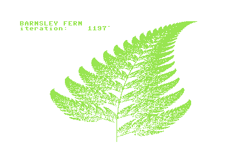
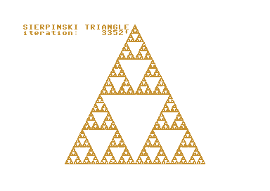

# Barnsley Fern in Simon's BASIC

A chaos game generated fern written in Simon's BASIC for the C64.

## Prerequisites

You'll need:

  * x64
  * petcat

Optional:

  * A real C64
  * A way to transfer a prg to the C64
  * A Simon's BASIC cartridge
  * Patience

## Run

`$> make run`

If you want to generate the Sierpinski triangle...

`$> make run NAME=sierpinski`

## Example

### Barnsley Fern



### Sierpinski triangle




# Copyright

(c) 2019 Johan Van den Brande

```
  (\/)
 ( ..)
C(")(")
```
